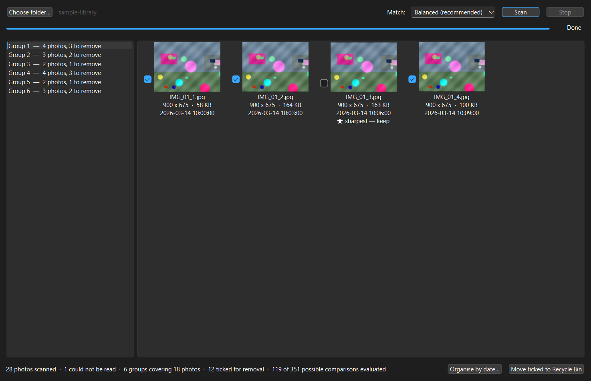

# Winnow

Finds the near-duplicate photographs in a folder — the six frames of the same
moment, the three attempts at the same shot — groups them, works out which one
is sharpest, and helps you delete the rest safely.

*To winnow is to separate the grain from the chaff.*



C++17 · Qt 6 · CMake · 60 tests in 8 suites under CTest

---

## The problem

Everyone has a folder with thousands of photos in it, and a large fraction of
them are the same picture taken several times. Nobody sorts them by hand.

Finding *identical* files is easy — hash the bytes and compare. That is not the
problem here. Two frames of the same burst differ in millions of pixels: the
camera moved a millimetre, the light shifted, the sensor produced different
noise. Their bytes have nothing in common. A cryptographic hash is built
specifically so that a one-bit change produces a completely unrelated output,
which is the exact opposite of what is needed.

What is needed is a hash where **similar inputs produce similar outputs**.

## How it works

### 1. A perceptual hash describes what the picture looks like

Each image is reduced to a 9×8 grid of grey samples. Then each sample is
compared with the one to its right: the bit is 1 when the left is brighter.
That is 8 comparisons per row, 8 rows, **64 bits** — the whole photograph
described as a single number.

Two images are near-duplicates when their hashes differ in only a few bits, a
count called the *Hamming distance*.

The comparison is deliberately **relative** rather than absolute. Adding a
constant to every pixel — which is what a change in exposure does — leaves the
result of every "is this brighter than that" question completely unchanged, so
the hash does not move at all. There is a test asserting exactly that.

The downscale averages each region rather than sampling one pixel from it. That
averaging is a low-pass filter: it discards precisely the fine detail that makes
two photographs of one scene differ, and keeps the coarse structure that makes
them the same.

### 2. A pigeonhole argument avoids almost every comparison

The obvious way to group 20,000 photos is to compare every hash with every other
one — 200 million comparisons.

Instead, each 64-bit hash is cut into **8 bands of 8 bits**. If two hashes
differ in at most 7 bits, those differing bits cannot possibly reach into all
eight bands — there are not enough of them. So **at least one band must be
bit-for-bit identical**.

That converts an approximate-match problem into an exact-match one: index each
band in a hash table, and two photos are worth comparing only if they collide in
some band. Everything else is *provably* not a near-duplicate and is never
looked at.

This is an exact optimisation, not a heuristic — it cannot miss a match. The
test suite proves it by running the fast path and an exhaustive brute-force
implementation over the same data and asserting the groups come out identical,
across four different thresholds.

Groups are then formed with union-find, so "A matches B" and "B matches C"
merge into one group.

### 3. Sharpness picks the keeper

Within a group, each photo is scored by the **variance of its Laplacian**. The
Laplacian responds to abrupt brightness changes — in-focus edges. A sharp frame
produces a wide spread of strong responses; blur smooths those away and the
variance collapses.

### 4. The date comes from the file, parsed by hand

Sorting by file modification time is wrong: it records when the file was last
*copied*, so restoring a backup makes an entire library appear to have been shot
on one day. The real capture time is in the JPEG's EXIF metadata, which Winnow
parses directly from the bytes — the segment chain, the APP1 block, a
little- or big-endian TIFF structure, and the tag inside it.

That parser reads untrusted input, so every read is bounds-checked. One test
truncates a file at every possible length and another corrupts every byte in
turn, asserting that none of it crashes or reads out of bounds.

---

## Architecture

```
ui  ──────┐
          ├──→  core  ←── imaging
main() ───┘
```

- **`src/core/`** — no Qt at all. Hashing, sharpness, EXIF parsing, grouping,
  the thread pool, the organise planner. Works on a plain `GrayImage` struct.
- **`src/imaging/`** — the only file in the project that knows JPEG and PNG
  exist. Implements the `PhotoDecoder` interface declared in `core/`.
- **`src/ui/`** — the window, and a worker that runs scans off the UI thread.

`PhotoDecoder` being an interface owned by `core/` is what lets every algorithm
be tested against images generated in memory — no photographs in the repository,
no codec, no files. The whole suite runs in about a second.

### Threading

Two separate layers, for two different reasons:

- The scan runs on **its own thread** so the window keeps repainting and the
  Stop button keeps working.
- Inside it, a hand-written **thread pool** spreads image decoding across every
  core, because decoding dominates the runtime completely.

Work is claimed dynamically — each worker takes the next index when it becomes
free — rather than sliced up front. Decode cost varies enormously with
resolution, so fixed slices would leave most workers idle waiting for whichever
one was handed the large files.

Images are decoded at reduced scale directly by the codec. A 64-bit hash does
not need 48 megapixels, and asking for a smaller image is far cheaper than
decoding fully and shrinking afterwards.

---

## Safety

Deleting photographs is not reversible, and the program is not qualified to
judge which of two near-identical pictures matters to the person who took them.
So:

- Files go to the **Recycle Bin**, never a permanent delete.
- Nothing happens without confirmation, showing exact counts.
- The suggested keeper is pre-ticked, but every tick can be changed.
- Organising **never overwrites** — a name already taken gets a number appended.
- The organise plan is computed in full, and shown, before a single file moves.

That last point is also why the planner is a pure function from strings to
strings: every naming and collision rule is unit-tested without creating a
single file.

---

## Building

CMake ≥ 3.21, Qt 6, a C++17 compiler.

```bash
cmake -S . -B build -G Ninja -DCMAKE_BUILD_TYPE=Release
cmake --build build
```

On this machine, where CMake is not on `PATH`:

```bash
/d/Qt/Tools/CMake_64/bin/cmake.exe -S . -B build -G Ninja -DCMAKE_BUILD_TYPE=Debug -DCMAKE_PREFIX_PATH='D:/Qt/6.10.0/mingw_64' -DCMAKE_CXX_COMPILER='D:/Qt/Tools/mingw1310_64/bin/g++.exe' -DCMAKE_MAKE_PROGRAM='D:/Qt/Tools/Ninja/ninja.exe'
```

Run the tests:

```bash
cd build && ctest
```

Generate a sample library and regenerate the screenshot:

```bash
./build/make_sample_library.exe sample-library
./build/make_screenshot.exe sample-library docs/screenshot.png
```

The sample library is synthetic and has a known correct answer, which is what
makes the screenshot above reproducible rather than a lucky capture of somebody's
camera roll.

---

## Known limitations

- **The sharpness score cannot tell detail from noise.** Both are
  high-frequency, so a grainy frame can outscore a cleaner one. It reliably
  rejects genuinely blurred frames, which is the case that matters most, but the
  "sharpest" label is a suggestion and not a verdict. A real fix would denoise
  first or use a noise-robust focus measure.
- **Sharpness is only comparable within a group.** It depends on how much
  contrast the scene contains, so a sharp photo of a blank wall scores below a
  blurry photo of a bookshelf. Comparing across different subjects is meaningless.
- **Grouping is transitive.** If A matches B and B matches C, all three end up in
  one group even when A and C are further apart than the threshold. That is
  usually right for a burst drifting frame by frame, but it can over-merge a
  library of visually flat images.
- **Very flat images hash unstably.** Where two neighbouring regions have almost
  the same brightness, the comparison between them is a near-tie that the
  smallest change can flip. Photographs of textured scenes are unaffected;
  screenshots, scans and blank walls are the weak case.
- **Only the first 128 KB of a file is searched for EXIF.** The APP1 segment is
  at the start of a JPEG in practice, but a file that buried it later would be
  reported as undated.
- **Cropped and rotated-by-hand duplicates are not found.** dHash is not
  invariant to either. A DCT-based hash would handle more, at the cost of
  considerably more code.
- **The library is rebuilt from scratch on every scan.** Nothing is cached
  between runs, so rescanning a large folder repeats all the decoding.
- **No automated UI tests.** Everything below the UI is covered.
